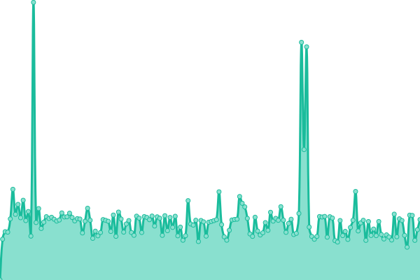

# [📈 Live Status](https://upptime.github.io/upptime): <!--live status--> **🟩 All systems operational**

This repository contains the open-source uptime monitor and status page for [Upptime](https://upptime.js.org), powered by [Upptime](https://github.com/upptime/upptime).

With [Upptime](https://upptime.js.org), you can get your own unlimited and free uptime monitor and status page, powered entirely by a GitHub repository. We use [Issues](https://github.com/upptime/upptime/issues) as incident reports, [Actions](https://github.com/ilumitr/vn-isp-monitoring/actions) as uptime monitors, and [Pages](https://upptime.github.io/upptime) for the status page.

<!--start: status pages-->
<!-- This summary is generated by Upptime (https://github.com/upptime/upptime) -->
<!-- Do not edit this manually, your changes will be overwritten -->
<!-- prettier-ignore -->
| URL | Status | History | Response Time | Uptime |
| --- | ------ | ------- | ------------- | ------ |
|  [CMC Telecom](http://hcmspeedtest.cmctelecom.vn:8080) | 🟩 Up | [cmc-telecom.yml](https://github.com/trilwu/vn-isp-monitoring/commits/HEAD/history/cmc-telecom.yml) | 

 769ms
     
 | 

<a href="https://ilumitr.github.io/vn-isp-monitoring/history/cmc-telecom">67.21%</a>
    

|  [FPT Telecom](http://speedtest.fpt.vn:8080) | 🟩 Up | [fpt-telecom.yml](https://github.com/trilwu/vn-isp-monitoring/commits/HEAD/history/fpt-telecom.yml) | 

 896ms
     
 | 

<a href="https://ilumitr.github.io/vn-isp-monitoring/history/fpt-telecom">100.00%</a>
    

|  [Mobifone](http://sp1.mobifone.vn:8080) | 🟩 Up | [mobifone.yml](https://github.com/trilwu/vn-isp-monitoring/commits/HEAD/history/mobifone.yml) | 

 963ms
     
 | 

<a href="https://ilumitr.github.io/vn-isp-monitoring/history/mobifone">100.00%</a>
    

|  [NetNam](http://speedtest4.hcmc.netnam.vn:8080) | 🟩 Up | [net-nam.yml](https://github.com/trilwu/vn-isp-monitoring/commits/HEAD/history/net-nam.yml) | 

 965ms
     
 | 

<a href="https://ilumitr.github.io/vn-isp-monitoring/history/net-nam">100.00%</a>
    

|  [SCTV](http://hcm-speedtest01.sctv.com.vn:8080) | 🟩 Up | [sctv.yml](https://github.com/trilwu/vn-isp-monitoring/commits/HEAD/history/sctv.yml) | 

 1189ms
     
 | 

<a href="https://ilumitr.github.io/vn-isp-monitoring/history/sctv">100.00%</a>
    

|  [Vietnamobile](http://vnmhcmspt1.vietnamobile.com.vn:8080) | 🟩 Up | [vietnamobile.yml](https://github.com/trilwu/vn-isp-monitoring/commits/HEAD/history/vietnamobile.yml) | 

 1095ms
     
 | 

<a href="https://ilumitr.github.io/vn-isp-monitoring/history/vietnamobile">100.00%</a>
    

|  [Viettel](http://speedtestkv3b.viettel.vn:8080) | 🟩 Up | [viettel.yml](https://github.com/trilwu/vn-isp-monitoring/commits/HEAD/history/viettel.yml) | 

 992ms
     
 | 

<a href="https://ilumitr.github.io/vn-isp-monitoring/history/viettel">100.00%</a>
    

|  [VNPT](http://speedtest3.vtn.com.vn:8080) | 🟩 Up | [vnpt.yml](https://github.com/trilwu/vn-isp-monitoring/commits/HEAD/history/vnpt.yml) | 

 1033ms
     
 | 

<a href="https://ilumitr.github.io/vn-isp-monitoring/history/vnpt">100.00%</a>
    

<!--end: status pages-->

[**Visit our status website →**](https://upptime.github.io/upptime)

## 📄 License

- Powered by: [Upptime](https://github.com/upptime/upptime)
- Code: [MIT](./LICENSE) © [Upptime](https://upptime.js.org)
- Data in the `./history` directory: [Open Database License](https://opendatacommons.org/licenses/odbl/1-0/)
